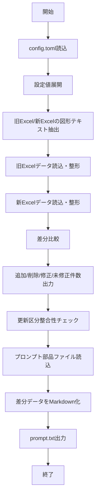

以下に、提示いただいたコードをベースとした**設計書（Markdown形式）**を作成します。  
そのまま社内向け資料やレビュー用のたたき台として使えるよう、**概要設計＋詳細設計**の形で整理しています。

---

# 差分抽出・更新区分検証・LLMプロンプト生成ツール 設計書

## 1. 文書情報

| 項目 | 内容 |
|---|---|
| 文書名 | 差分抽出・更新区分検証・LLMプロンプト生成ツール 設計書 |
| 対象プログラム | Pythonスクリプト |
| 作成対象 | Excelマスタ比較処理 |
| ベースコード | pandas / zipfile / lxml / toml を用いた差分抽出処理 |
| 作成日 | YYYY-MM-DD |
| 作成者 | XXX |

---

## 2. システム概要

### 2.1 目的
本ツールは、2つのExcelマスタファイルを比較し、以下を実施することを目的とする。

1. Excelマスタデータの読込・正規化
2. 新旧データの差分判定
   - 追加
   - 削除
   - 修正
   - 未修正
3. 更新区分列の整合性チェック
4. Excel内図形（テキストボックス等）からの特定ラベル値抽出
5. 差分データをもとにLLM（生成AI）へ投入するためのプロンプト生成

---

## 3. 適用範囲

本設計書は、以下の処理を対象とする。

- 設定ファイル（TOML）の読込
- Excelファイル（`.xlsm` / `.xlsx`）の読込
- 図形テキスト抽出
- シートデータ整形
- 新旧比較
- 更新フラグ整合性検証
- プロンプトファイル生成

---

## 4. 前提条件

### 4.1 入力ファイル
- 比較対象Excelファイル
  - `ServiceCode1.xlsm`（旧）
  - `ServiceCode2.xlsm`（新）
- 設定ファイル
  - `config.toml`
- プロンプト部品ファイル
  - role定義ファイル
  - input_format定義ファイル
  - output_format定義ファイル
  - check_rules定義ファイル

### 4.2 使用ライブラリ
- pandas
- zipfile
- lxml
- warnings
- os
- toml
- pathlib

### 4.3 動作前提
- Python 実行環境が整っていること
- Excelファイルのシート構成・ヘッダ行・データ開始行が `config.toml` と一致していること
- 主キー列が正しく設定されていること

---

## 5. システム構成

## 5.1 全体構成図

```text
+------------------+
|  config.toml     |
+------------------+
         |
         v
+---------------------------+
| 設定読込(load_config)     |
+---------------------------+
         |
         v
+---------------------------+         +------------------------------+
| Excel図形抽出             |<------->| ServiceCode1.xlsm / 2.xlsm |
| get_excel_shapes_lxml     |         +------------------------------+
+---------------------------+
         |
         v
+---------------------------+
| Excelシート読込・整形     |
| process_master_sheet      |
+---------------------------+
         |
         v
+---------------------------+
| 差分比較                  |
| compare_datasets          |
+---------------------------+
         |
         +--------------------+
         |                    |
         v                    v
+-------------------+   +-----------------------------+
| 更新区分整合性確認 |   | LLM用プロンプト生成         |
+-------------------+   +-----------------------------+
         |                    |
         v                    v
   コンソール出力          prompt.txt
```

---

## 6. 機能一覧

| 機能ID | 機能名 | 概要 |
|---|---|---|
| F01 | 設定読込機能 | TOML形式設定ファイルを読み込む |
| F02 | Excel図形抽出機能 | Excel内部XMLから図形名に対応するテキストを取得する |
| F03 | マスタシート読込機能 | 指定シートのデータを文字列として読み込み正規化する |
| F04 | 差分比較機能 | 旧・新データを比較し追加/削除/修正/未修正を分類する |
| F05 | 更新区分検証機能 | 差分結果に応じた更新区分列の値が正しいか確認する |
| F06 | テキストファイル読込機能 | プロンプト部品テキストを読み込む |
| F07 | プロンプト生成機能 | 差分データをMarkdownで埋め込み、prompt.txtを生成する |
| F08 | メイン制御機能 | 各機能を順次呼び出して全体処理を実行する |

---

## 7. 入出力仕様

# 7.1 入力一覧

| 入力名 | ファイル/値 | 説明 |
|---|---|---|
| 設定ファイル | `config.toml` | 比較対象シート名、主キー、ヘッダ行、更新区分等を定義 |
| 旧Excel | `ServiceCode1.xlsm` | 比較元データ |
| 新Excel | `ServiceCode2.xlsm` | 比較先データ |
| プロンプト定義 | 複数txt | role/input/output/check_rulesを格納 |

---

# 7.2 出力一覧

| 出力名 | 形式 | 説明 |
|---|---|---|
| コンソール出力 | 標準出力 | 図形テキスト、件数統計、整合性検証結果 |
| `prompt.txt` | テキスト | LLM投入用プロンプト |
| 例外 | 標準エラー相当 | 設定ファイル不存在、Excel解析失敗等 |

---

## 8. 設定ファイル設計

## 8.1 `config.toml` 想定構造

```toml
[master_servicecode]
sheet_name = "Sheet1"
primary_keys = ["サービスコード"]
ignore_cols = ["更新日時"]
head_row = 3
data_row = 5
excel_labels = ["版数", "チェック結果"]

[update_flag]
flag_col = "更新区分"
add = "追加"
update = "修正"
delete = "削除"
unmodified = ""

[prompt_files]
role = "role.txt"
input_format = "input_format.txt"
output_format = "output_format.txt"
check_rules = "check_rules.txt"
```

## 8.2 設定項目一覧

### master_servicecode

| 項目名 | 型 | 必須 | 説明 |
|---|---|---|---|
| sheet_name | str | 必須 | 読み込むシート名 |
| primary_keys | list[str] | 必須 | 主キー列名一覧 |
| ignore_cols | list[str] | 任意 | 比較除外列 |
| head_row | int | 必須 | ヘッダ行番号（1始まり） |
| data_row | int | 必須 | データ開始行番号（1始まり） |
| excel_labels | list[str] | 任意 | 図形テキスト抽出対象のラベル名 |

### update_flag

| 項目名 | 型 | 必須 | 説明 |
|---|---|---|---|
| flag_col | str | 必須 | 更新区分列名 |
| add | str | 必須 | 追加時の期待値 |
| update | str | 必須 | 修正時の期待値 |
| delete | str | 任意 | 削除時の期待値 |
| unmodified | str | 任意 | 未修正時の期待値 |

### prompt_files

| 項目名 | 型 | 必須 | 説明 |
|---|---|---|---|
| role | str | 必須 | 役割定義ファイル |
| input_format | str | 必須 | 入力形式定義ファイル |
| output_format | str | 必須 | 出力形式定義ファイル |
| check_rules | str | 必須 | チェックルール定義ファイル |

---

## 9. 処理フロー

## 9.1 全体処理フロー



---

## 10. 関数設計

# 10.1 `load_config(config_path="config.toml")`

### 機能概要
TOML形式設定ファイルを読み込んで辞書形式で返却する。

### 入力

| 引数名 | 型 | 必須 | 説明 |
|---|---|---|---|
| config_path | str | 任意 | 設定ファイルパス |

### 出力

| 戻り値 | 型 | 説明 |
|---|---|---|
| 設定情報 | dict | TOML読込結果 |

### 処理内容
1. ファイル存在確認
2. 存在しない場合 `FileNotFoundError` を送出
3. `toml.load()` で読込

### 例外
- `FileNotFoundError`

---

# 10.2 `get_excel_shapes_lxml(file_path, target_labels)`

### 機能概要
Excelファイル内部のDrawing XMLを直接解析し、指定した図形名のテキストを抽出する。

### 入力

| 引数名 | 型 | 必須 | 説明 |
|---|---|---|---|
| file_path | str | 必須 | Excelファイルパス |
| target_labels | list[str] | 必須 | 取得対象図形名一覧 |

### 出力

| 戻り値 | 型 | 説明 |
|---|---|---|
| results | dict | `{図形名: テキスト}` |

### 処理内容
1. 戻り値辞書を `"Not Found"` で初期化
2. ExcelをZIPとして開く
3. `xl/drawings/drawing*.xml` を探索
4. `xdr:sp` 要素を抽出
5. 図形名 (`cNvPr/@name`) を取得
6. 対象図形名に一致した場合、`a:t` テキストを連結して格納
7. エラー時はコンソールに表示

### 注意事項
- Excelファイル構造に依存する
- openpyxlで取得しにくい描画オブジェクトの文字列取得を目的とする

---

# 10.3 `process_master_sheet(file_path, sheet_name, keys, head_row, data_row)`

### 機能概要
Excelシートを読み込み、比較可能な形式に正規化する。

### 入力

| 引数名 | 型 | 必須 | 説明 |
|---|---|---|---|
| file_path | str | 必須 | Excelファイルパス |
| sheet_name | str | 必須 | 対象シート名 |
| keys | list[str] | 必須 | 主キー列 |
| head_row | int | 必須 | ヘッダ行番号（1始まり） |
| data_row | int | 必須 | データ開始行番号（1始まり） |

### 出力

| 戻り値 | 型 | 説明 |
|---|---|---|
| df | DataFrame | 整形済みデータ |

### 処理内容
1. `head_row` を0始まりへ変換
2. `pd.read_excel()` で全列を文字列として読込
   - `dtype=str`
   - `keep_default_na=False`
3. `head_row` と `data_row` の差分行をスキップ
4. 列名の改行除去
5. 全セルを文字列化＋trim
6. 全項目空の行を削除
7. 主キーでソートしインデックス再採番

### データ整合性対策
- `001` が `1` にならないよう型推論を抑止
- 空白を `NaN` 扱いせず空文字として保持
- 列名改行を除去してカラム一致精度を向上

### 留意点
コード上では「主キー欠損行削除」のコメントがあるが、実装は `dropna(subset=keys)` のみであり、  
`keep_default_na=False` かつ `astype(str)` を使用しているため、**空文字の主キー行は削除されない可能性がある**。  
必要に応じて以下のような追加実装を推奨する。

```python
df = df[~df[keys].apply(lambda col: col.str.strip().eq("")).any(axis=1)]
```

---

# 10.4 `compare_datasets(df1, df2, keys, ignore_cols)`

### 機能概要
旧データと新データを比較し、追加・削除・修正・未修正に分類する。

### 入力

| 引数名 | 型 | 必須 | 説明 |
|---|---|---|---|
| df1 | DataFrame | 必須 | 旧データ |
| df2 | DataFrame | 必須 | 新データ |
| keys | list[str] | 必須 | 主キー列 |
| ignore_cols | list[str] | 任意 | 比較除外列 |

### 出力

| 戻り値 | 型 | 説明 |
|---|---|---|
| added | DataFrame | 新にのみ存在するデータ |
| deleted | DataFrame | 旧にのみ存在するデータ |
| modified | DataFrame | 同一キーで内容差異あり |
| unmodified | DataFrame | 同一キーで差異なし |

### 処理内容
1. 新旧それぞれの主キー集合を取得
2. 左外部結合＋`indicator=True` により追加データ抽出
3. 左外部結合＋`indicator=True` により削除データ抽出
4. 共通キーを取得
5. 共通キーの行同士をソートして突合
6. 主キー・除外列以外を比較対象列とする
7. 行単位・列単位で差異判定
8. 1項目でも差異があれば修正、なければ未修正

### 判定ルール
- 比較値は文字列化した上で `.strip()` 後に比較
- 空白差分は無視
- `ignore_cols` は差分判定対象外

### 留意点
- 同一主キーの重複行がある場合、想定外の比較結果となる可能性あり
- `df1.columns` に存在するが `df2.columns` に存在しない列がある場合はエラーとなる可能性あり

---

# 10.5 `read_text_file(filename)`

### 機能概要
指定ファイルをUTF-8で読み込む。存在しない場合はメッセージ文字列を返す。

### 入力

| 引数名 | 型 | 必須 | 説明 |
|---|---|---|---|
| filename | str | 必須 | 読み込み対象ファイル |

### 出力

| 戻り値 | 型 | 説明 |
|---|---|---|
| text | str | ファイル内容またはエラーメッセージ |

### 特記事項
例外送出ではなく、代替文字列を返す仕様。

---

# 10.6 `extract_delta_data()`

### 機能概要
本プログラムのメイン処理。設定読込から差分抽出、検証、プロンプト生成までを実行する。

### 主処理
1. 設定読込
2. 設定値展開
3. Excel図形情報出力
4. 新旧マスタ読込
5. 差分比較
6. 統計表示
7. 更新区分整合性検証
8. プロンプト部品読込
9. Markdown生成
10. `prompt.txt` 出力

### 出力内容
- 差分件数
- 不整合のある更新区分行
- 生成したプロンプトファイル

---

## 11. 差分判定仕様

## 11.1 追加
- 新データに存在
- 旧データに非存在

## 11.2 削除
- 旧データに存在
- 新データに非存在

## 11.3 修正
- 新旧ともに同一主キーが存在
- 比較対象列のうち1項目以上が相違

## 11.4 未修正
- 新旧ともに同一主キーが存在
- 比較対象列がすべて一致

---

## 12. 更新区分整合性チェック仕様

更新区分列（`flag_col`）の値を、差分分類ごとにチェックする。

| 分類 | 対象データ | 期待値 |
|---|---|---|
| 追加 | `added` | `flags['add']` |
| 修正 | `modified` | `flags['update']` |
| 削除 | `deleted` | `flags['delete']` または `"削除"` |
| 未修正 | `unmodified` | `flags['unmodified']` または `""` |

### 不整合時の動作
- 警告メッセージを表示
- 主キー＋更新区分列をMarkdownテーブルで出力

---

## 13. プロンプト生成仕様

## 13.1 生成対象
LLMへ投入するためのテキストファイル `prompt.txt`

## 13.2 構成
以下の順にテキストを連結する。

1. role
2. input_format
3. output_format
4. check_rules
5. 追加データ（Markdown）
6. 修正データ（Markdown）

## 13.3 生成イメージ

```text
[role.txt内容]
[input_format.txt内容]
[output_format.txt内容]
[check_rules.txt内容]

### 追加データ (Markdown)
| ... |

### 修正データ (Markdown)
| ... |
```

### 補足
- 削除データ・未修正データは現在のプロンプトには含めない仕様
- 追加・修正が存在しない場合は `"なし"` を出力

---

## 14. エラー処理設計

| 発生箇所 | 条件 | 対応 |
|---|---|---|
| `load_config` | 設定ファイル不存在 | `FileNotFoundError` 送出 |
| `get_excel_shapes_lxml` | Excel内部XML解析失敗 | エラーメッセージ出力、処理継続 |
| `read_text_file` | テキストファイル不存在 | エラーメッセージ文字列を返却 |
| `pd.read_excel` | シート不存在・ファイル不正 | 例外発生（現状は上位未捕捉） |
| 差分比較 | 主キー列不一致、列不足 | 例外発生の可能性あり |

---

## 15. 非機能要件

## 15.1 保守性
- 設定値をTOML化し、コード改修なしで対象変更可能
- 関数単位に分離されており再利用しやすい構造

## 15.2 可読性
- コメント付き実装
- 変数名、関数名が用途を表している

## 15.3 拡張性
- マスタ種類追加時は `config.toml` の別セクション化で対応可能
- 出力形式をCSV/Excelへ拡張可能
- 差分結果のAIレビュー機能追加が容易

---

## 16. 制約事項・注意点

1. 比較対象ファイル名がコード内固定  
   - `ServiceCode1.xlsm`
   - `ServiceCode2.xlsm`

2. 図形抽出はExcelのOpen XML構造に依存  
   - 一部形式では取得できない可能性あり

3. 主キー重複への明示的チェックがない  
   - 重複時に比較結果が不正になる可能性あり

4. 空文字主キーの除外が不完全  
   - 実装改善推奨

5. 追加・修正のみがLLMプロンプト対象  
   - 必要に応じて削除・未修正の出力拡張が必要

---

## 17. 改善提案

| No | 改善案 | 目的 |
|---|---|---|
| 1 | 入力ファイル名を設定ファイル化 | 固定値排除 |
| 2 | 主キー重複チェック追加 | データ品質向上 |
| 3 | 空文字主キー除外強化 | 比較精度向上 |
| 4 | 差分結果をCSV/Excel出力 | 利用性向上 |
| 5 | ログ出力導入 | 障害解析容易化 |
| 6 | 例外処理統一 | 安定性向上 |
| 7 | テストコード整備 | 品質担保 |

---

## 18. テスト観点

### 18.1 正常系
- 設定ファイルが存在し、正しい形式で読込可能
- 旧新Excelが正しく読込可能
- 追加/削除/修正/未修正が正しく分類される
- 更新区分整合性が正常判定される
- `prompt.txt` が生成される

### 18.2 異常系
- `config.toml` が存在しない
- シート名が存在しない
- 主キー列が存在しない
- 図形XMLが破損している
- プロンプト部品ファイルが存在しない
- Excelデータが空
- 主キー重複あり

### 18.3 境界値
- 差分0件
- 全件追加
- 全件削除
- 全件修正
- 空白文字のみのセル
- 改行入りヘッダ
- 先頭ゼロを含むコード値

---

## 19. 擬似画面／出力例

### 19.1 コンソール出力例

```text
--- ServiceCode1.xlsm ---
版数: 21.08
チェック結果: エラーあり

--- ServiceCode2.xlsm ---
版数: 21.09
チェック結果: OK

統計: 追加(10) 削除(2) 修正(5) 未修正(120)

![警告] 追加データの更新区分が不正な行があります (期待値: 追加)
| サービスコード | 更新区分 |
|---|---|
| 001 | 修正 |
```

### 19.2 `prompt.txt` 出力例

```text
あなたはマスタ差分監査の専門家です。
...
### 追加データ (Markdown)
| サービスコード | 名称 | 更新区分 |
|---|---|---|
| 001 | AAA | 追加 |

### 修正データ (Markdown)
| サービスコード | 名称 | 更新区分 |
|---|---|---|
| 002 | BBB改 | 修正 |
```

---

## 20. 付録：モジュール一覧

| モジュール/関数 | 役割 |
|---|---|
| `load_config` | 設定読込 |
| `get_excel_shapes_lxml` | 図形内テキスト抽出 |
| `process_master_sheet` | Excelシート読込・正規化 |
| `compare_datasets` | 差分比較 |
| `read_text_file` | テキストファイル読込 |
| `extract_delta_data` | メイン制御 |

---

必要であれば次に以下のいずれかも作成できます。  
1. **この設計書を「基本設計書」形式に整える**  
2. **この設計書を「詳細設計書」形式にして、関数ごとの入出力・処理ロジックをさらに細かくする**  
3. **`config.toml` のサンプルを業務用に具体化する**  
4. **このコードのシーケンス図・クラス図・処理フロー図を追加する**  

必要なら次に**Word貼り付け向けの体裁版**で再整形します。